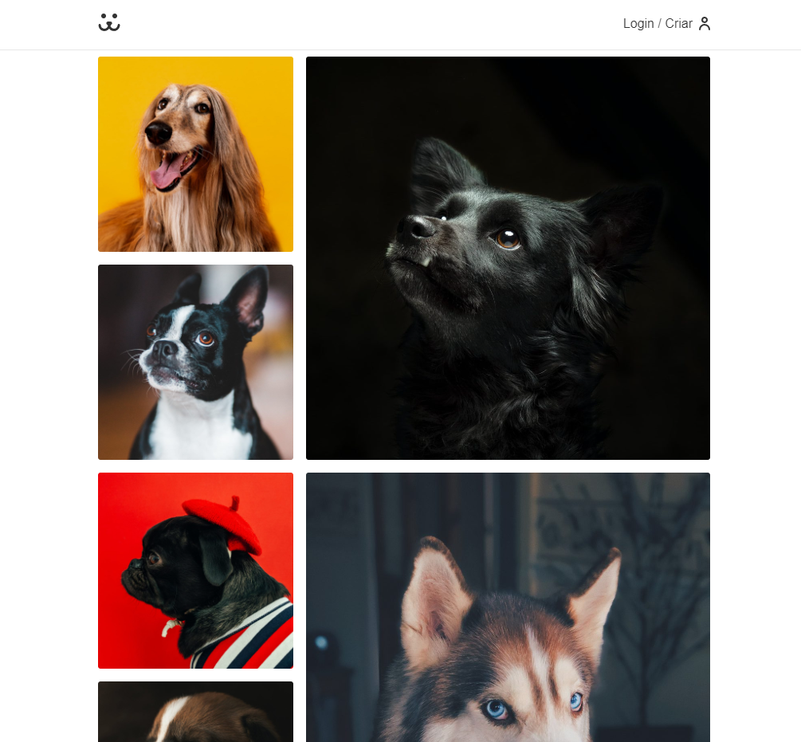
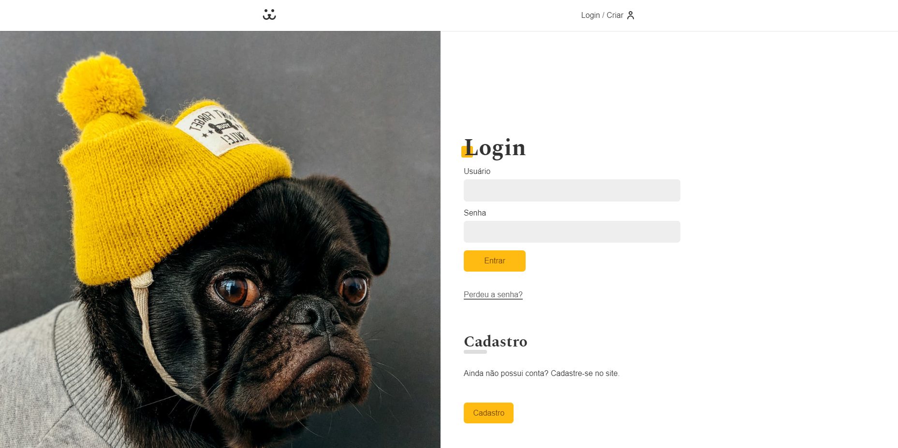
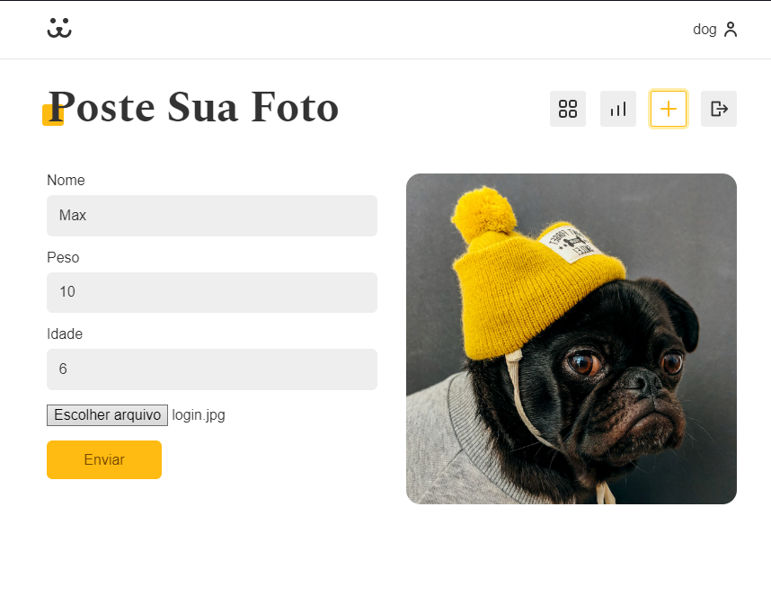
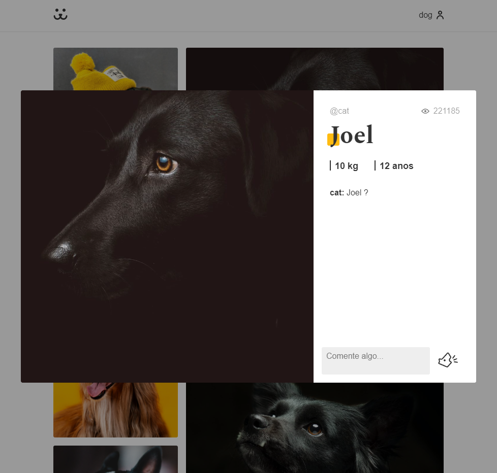

# Rede social para cachorros

## Descrição do projeto

Site com intuito de ser uma rede social para cachorros, com login e cadastro de usuários. A plataforma oferece as seguintes funcionalidades:

- Feed com todas publicações
- Postar publicações
- Visitar outro perfis
- Comentar e curir publicações
- Página com estatíticas das visualizações

As requisições do sistemas, como logar na plataforma, buscar por publicações, entre outras são feitas por meio de uma API Rest.

## Tecnologias Utlizadas:

- HTML
- Javascript
- CSS
- React

## Algumas imagens do site

### Feed (Home)

### Login

### Nova Foto

### Post

